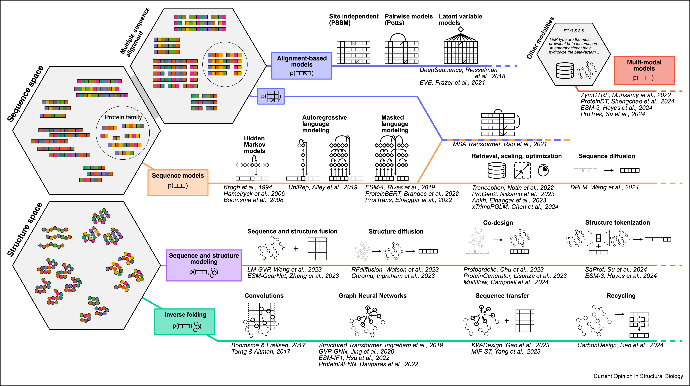

# Awesome Protein Foundation Models

> **A curated list of protein foundation models and generative models for protein sequence, structure, and multimodal biological modeling.**


The field has evolved from family-specific statistical models to large self-supervised foundation models trained on evolutionary-scale protein datasets. Taxonomy and model selection are based on the review `Foundation models of protein sequences: a brief overview`, including the distributional view `p(x)`, `p(x, s)`, `p(x | s)`, and `p(x, m)`. 

The repository focuses on models capable of:
- representation learning
- generative protein design
- zero-shot variant effect prediction
- multimodal protein modeling

Citations are auto-updated in-place using live OpenAlex/`shields.io` badges. Beware that these counts are usually smaller than those observed on Google Scholar.

If you find this repository useful, please consider putting a star for later!


<!-- ## Contents
- Historical models 
- Alignment-based models
- Sequence models `p(x)`
- Sequence and structure modeling `p(x|s)`
- Inverse folding `p(x|s)`
- Multi-modal models `p(x,m)` or `p(x|m)`
- Benchmarks
- Datasets
- Libraries -->

## Overview
2025 snapshot from our review paper: [_Foundation models of protein sequences: a brief overview_](https://arxiv.org/abs/2505.00671). 



## Historical models
Early probabilistic and family-level generative models.

| Model | Paper | Venue | Year | Citations | Notes |
| --- | --- | --- | ---: | --- | --- |
| HMMs | [Hidden Markov Models in Computational Biology](https://doi.org/10.1006/jmbi.1994.1104) | Journal of Molecular Biology | 1994 | [](https://openalex.org/W2102122585) | Markovian sequence models for protein families. |
| PSSM / PSI-BLAST | [Gapped BLAST and PSI-BLAST: a new generation of protein database search programs](https://doi.org/10.1093/nar/25.17.3389) | Nucleic Acids Research | 1997 | [](https://openalex.org/W2158714788) | Site-independent profile model over aligned families. |
| Potts / DCA | [Sequence co-evolution gives 3D contacts and structures of protein complexes](https://doi.org/10.7554/elife.03430) | eLife | 2014 | [](https://openalex.org/W2120836664) | Pairwise co-evolution modeling for contact and fitness signals. |
| ProtVec | [Continuous distributed representation of biological sequences for deep proteomics and genomics](https://doi.org/10.1371/journal.pone.0141287) | PLOS ONE | 2015 | [](https://openalex.org/W1501531009) | k-mer embedding pretraining for protein sequence representations. |
| DeepSequence | [Deep generative models of genetic variation capture the effects of mutations](https://doi.org/10.1038/s41592-018-0138-4) | Nature Methods | 2018 | [](https://openalex.org/W2890223884) | Latent variable (VAE) modeling over homologous alignments. |

## Alignment-based models
Models that leverage multiple sequence alignments or retrieval over homologs.

| Model | Paper | Venue | Year | Citations | Notes |
| --- | --- | --- | ---: | --- | --- |
| EVE | [Disease variant prediction with deep generative models of evolutionary data](https://doi.org/10.1038/s41586-021-04043-8) | Nature | 2021 | [](https://openalex.org/W3209435229) | Evolutionary VAE for variant effect prediction in families. |
| MSA Transformer | [MSA Transformer](https://doi.org/10.1101/2021.02.12.430858) | ICML | 2021 | [](https://openalex.org/W3133458480) | Transformer over full multiple sequence alignments. |
| Tranception | [Tranception: protein fitness prediction with autoregressive transformers and inference-time retrieval](https://doi.org/10.48550/arxiv.2205.13760) | ICML | 2022 | [](https://openalex.org/W4281648132) | Autoregressive LM with retrieval-time alignment context. |
| PoET | [PoET: A generative model of protein families as sequences-of-sequences](https://doi.org/10.48550/arxiv.2306.06156) | NeurIPS | 2024 | [](https://openalex.org/W4380551121) | Sequences-of-sequences family modeling with retrieval. |
| E-1 | [E1: Retrieval-Augmented Protein Encoder Models](https://www.biorxiv.org/content/10.1101/2025.11.12.688125v1) | Preprint / Workshop | 2025 | [](https://openalex.org/W4416246053) | Retrieval-augmented protein encoder. |
| Protriever | [Protriever: End-to-End Differentiable Protein Homology Search for Fitness Prediction](https://openreview.net/forum?id=GZ7gwOZ6Or) | ICML | 2025 | [](https://openalex.org/W4417258036) | Differentiable homolog search for fitness. |
| AIDO RAG | [Retrieval Augmented Protein Language Models for Structure Prediction](https://openreview.net/forum?id=uuZtbiqWdn) | Preprint / Workshop | 2025 | [](https://openalex.org/W4405044274) | Retrieval-augmented structure prediction. |

## Sequence models `p(x)`
Protein foundation models on the amino acid sequence space.

<!-- Subcategories:
- **Autoregressive:** ProGen2, xTrimoPGLM
- **Masked language models:** ProteinBERT, ESM-1b, ESM-2, Ankh
- **Efficient architectures:** ProtHyena, PTM-Mamba
- **Family-level models:** UniRep
- **Diffusion models:** DPLM -->

| Model | Paper | Venue | Year | Citations | Notes |
| --- | --- | --- | ---: | --- | --- |
| UniRep | [Unified rational protein engineering with sequence-based deep representation learning](https://doi.org/10.1038/s41592-019-0598-1) | Nature Methods | 2019 | [](https://openalex.org/W2980789587) | RNN pretraining for protein representations. |
| ProtTrans | [ProtTrans: Toward Understanding the Language of Life Through Self-Supervised Learning](https://doi.org/10.1109/tpami.2021.3095381) | IEEE | 2021 | [](https://openalex.org/W3177500196) | Large transformer pretraining on UniProt/BFD-scale corpora. |
| ESM-1b | [Biological structure and function emerge from scaling unsupervised learning to 250 million protein sequences](https://doi.org/10.1073/pnas.2016239118) | PNAS | 2021 | [](https://openalex.org/W3146944767) | Scaled transformer pLM with emergent structure/function signals. |
| ProteinBERT | [ProteinBERT: a universal deep-learning model of protein sequence and function](https://doi.org/10.1093/bioinformatics/btac020) | Bioinformatics | 2022 | [](https://openalex.org/W4205773061) | Masked language modeling with global-local architecture. |
| ESM-2 | [Evolutionary-scale prediction of atomic-level protein structure with a language model](https://doi.org/10.1126/science.ade2574) | Science | 2023 | [](https://openalex.org/W4327550249) | High-capacity pLM with strong zero-shot and structure signals. |
| ProGen2 | [ProGen2: Exploring the boundaries of protein language models](https://doi.org/10.1016/j.cels.2023.10.002) | Cell Systems | 2023 | [](https://openalex.org/W4388024559) | Autoregressive generative sequence foundation model. |
| Ankh | [Ankh : Optimized Protein Language Model Unlocks General-Purpose Modelling](https://doi.org/10.1101/2023.01.16.524265) | Preprint / Workshop | 2023 | [](https://openalex.org/W4317374308) | Compute-efficient pLM with strong downstream transfer. |
| xTrimoPGLM | [xTrimoPGLM: Unified 100B-Scale Pre-trained Transformer for Deciphering the Language of Protein](https://doi.org/10.1101/2023.07.05.547496) | Preprint / Workshop | 2023 | [](https://openalex.org/W4383550741) | 100B-scale protein language model. |
| ProtHyena | [Hyena architecture enables fast and efficient protein language modeling](https://doi.org/10.1002/imo2.45) | iMetaOmics | 2024 | [](https://openalex.org/W4405128624) | Fast, efficient Hyena pLM. |
| DPLM | [Diffusion Language Models Are Versatile Protein Learners](https://doi.org/10.48550/arxiv.2402.18567) | ICML | 2024 | [](https://openalex.org/W4403586429) | Diffusion language modeling for sequence generation. |
| ESM-C | [ESM Cambrian: Revealing the Mysteries of Proteins with Unsupervised Learning](https://www.evolutionaryscale.ai/blog/esm-cambrian) | Announcement / Release | 2024 | — | Sequence-only unsupervised encoder family. |
| PTM-Mamba | [PTM-Mamba: a PTM-aware protein language model with bidirectional gated Mamba blocks](https://doi.org/10.1038/s41592-025-02656-9) | Nature Methods | 2025 | [](https://openalex.org/W4409340338) | PTM-aware state-space modeling for scalable sequence learning. |
| EvoFlows | [EvoFlows: Evolutionary Edit-Based Flow-Matching for Protein Engineering](https://arxiv.org/abs/2603.11703) | Preprint / Workshop | 2026 | [](https://openalex.org/W7135167556) | Evolutionary edit-based flow matching. |

## Sequence and structure modeling `p(x,s)`
Generative models over both sequence and structure.

| Model | Paper | Venue | Year | Citations | Notes |
| --- | --- | --- | ---: | --- | --- |
| LM-GVP | [LM-GVP: an extensible sequence and structure informed deep learning framework for protein property prediction](https://doi.org/10.1038/s41598-022-10775-y) | Scientific Reports | 2022 | [](https://openalex.org/W4224939843) | Joint sequence-structure representation learning. |
| Chroma | [Illuminating protein space with a programmable generative model](https://doi.org/10.1038/s41586-023-06728-8) | Nature | 2023 | [](https://openalex.org/W4388694364) | Programmable generative modeling over protein space. |
| RFdiffusion | [De novo design of protein structure and function with RFdiffusion](https://doi.org/10.1038/s41586-023-06415-8) | Nature | 2023 | [](https://openalex.org/W4383957026) | Diffusion-based backbone generation with design conditioning. |
| SaProt | [SaProt: Protein Language Modeling with Structure-aware Vocabulary](https://doi.org/10.1101/2023.10.01.560349) | ICLR | 2024 | [](https://openalex.org/W4387303685) | Structure-tokenized sequence modeling in a unified vocabulary. |
| MULAN | [MULAN: multimodal protein language model for sequence and structure encoding](https://academic.oup.com/bioinformaticsadvances/article/5/1/vbaf117/8139638) | Bioinformatics Advances | 2024 | [](https://openalex.org/W4410572064) | Multimodal sequence-structure encoder. |
| ProteinGenerator | [Multistate and functional protein design using RoseTTAFold sequence space diffusion](https://doi.org/10.1038/s41587-024-02395-w) | Nature Biotechnology | 2024 | [](https://openalex.org/W4402827655) | Co-design via sequence diffusion with structure refinement. |
| Protpardelle | [An all-atom protein generative model](https://doi.org/10.1073/pnas.2311500121) | PNAS | 2024 | [](https://openalex.org/W4399999619) | All-atom generative protein modeling. |
| Multiflow | [Generative Flows on Discrete State-Spaces: Enabling Multimodal Flows with Applications to Protein Co-Design](https://doi.org/10.48550/arxiv.2402.04997) | ICML | 2024 | [](https://openalex.org/W4391673418) | Discrete flow matching for multimodal co-design. |
| La-Proteina | [La-Proteina: Atomistic Protein Generation via Partially Latent Flow Matching](https://arxiv.org/abs/2507.09466) | Preprint / Workshop | 2025 | [](https://openalex.org/W4414696188) | Partially latent atomistic generation. |
| Proteina-Complexa | [Scaling Atomistic Protein Binder Design with Generative Modeling and Optimization](https://openreview.net/forum?id=qmCpJtFZra) | ICLR | 2026 | — | Atomistic binder generation + optimization. |

## Inverse folding `p(x|s)`
Sequence generation conditioned on backbone structure.

| Model | Paper | Venue | Year | Citations | Notes |
| --- | --- | --- | ---: | --- | --- |
| Structured Transformer | [Generative models for graph-based protein design](https://openalex.org/W2957874522) | NeurIPS | 2019 | [](https://openalex.org/W2957874522) | Graph-based inverse folding from structure to sequence. |
| GVP-GNN | [Learning from Protein Structure with Geometric Vector Perceptrons](https://doi.org/10.48550/arxiv.2009.01411) | ICLR | 2021 | [](https://openalex.org/W3081836708) | Geometric message passing for structure-conditioned sequence tasks. |
| ProteinMPNN | [Robust deep learning-based protein sequence design using ProteinMPNN](https://doi.org/10.1126/science.add2187) | Science | 2022 | [](https://openalex.org/W4296032638) | State-of-the-art sequence design from backbone context. |
| ESM-IF1 | [Learning inverse folding from millions of predicted structures](https://doi.org/10.1101/2022.04.10.487779) | ICML | 2022 | [](https://openalex.org/W4223581484) | Inverse folding at scale from predicted structures. |
| MIF-ST | [Masked inverse folding with sequence transfer for protein representation learning](https://doi.org/10.1093/protein/gzad015) | Protein Engineering Design and Selection | 2022 | [](https://openalex.org/W4387966974) | Masked inverse folding with sequence transfer learning. |
| Knowledge-Design (KW-Design) | [Knowledge-Design: Pushing the Limit of Protein Design via Knowledge Refinement](https://doi.org/10.48550/arxiv.2305.15151) | ICLR | 2024 | [](https://openalex.org/W4378474135) | Knowledge refinement for structure-guided sequence design. |
| CarbonDesign | [Accurate and robust protein sequence design with CarbonDesign](https://doi.org/10.1038/s42256-024-00838-2) | Nature Machine Intelligence | 2024 | [](https://openalex.org/W4398243369) | Robust sequence design with iterative refinement. |

## Multi-modal models `p(x,m)` 
Models combining sequence/structure with text, ontology, or other modalities.

| Model | Paper | Venue | Year | Citations | Notes |
| --- | --- | --- | ---: | --- | --- |
| OntoProtein | [OntoProtein: Protein Pretraining With Gene Ontology Embedding](https://doi.org/10.48550/arxiv.2201.11147) | ICLR | 2022 | [](https://openalex.org/W4221157572) | Protein modeling with gene ontology context. |
| ProtST | [ProtST: Multi-Modality Learning of Protein Sequences and Biomedical Texts](https://doi.org/10.48550/arxiv.2301.12040) | ICML | 2023 | [](https://openalex.org/W4318751307) | Contrastive alignment of proteins and biomedical text. |
| ZymCTRL | [Conditional language models enable the efficient design of proficient enzymes](https://doi.org/10.1101/2024.05.03.592223) | Preprint / Workshop | 2024 | [](https://openalex.org/W4396675754) | EC-conditioned controllable generation of enzyme sequences. |
| ProTrek | [ProTrek: Navigating the Protein Universe through Tri-Modal Contrastive Learning](https://doi.org/10.1101/2024.05.30.596740) | Preprint / Workshop | 2024 | [](https://openalex.org/W4399285138) | Tri-modal contrastive navigation in protein space. |
| Prot2Text | [Prot2Text: Multimodal Protein's Function Generation with GNNs and Transformers](https://doi.org/10.1609/aaai.v38i10.28948) | AAAI | 2024 | [](https://openalex.org/W4393159659) | Protein-to-text multimodal function generation. |
| ESM-3 | [Simulating 500 million years of evolution with a language model](https://doi.org/10.1126/science.ads0018) | Science | 2025 | [](https://openalex.org/W4406440058) | Unified multimodal track modeling (sequence, structure, and function). |
| PoET-2 | [Understanding protein function with a multimodal retrieval-augmented foundation model](https://arxiv.org/abs/2508.04724) | NeurIPS | 2025 | [](https://openalex.org/W6910715270) | Multimodal retrieval-augmented protein modeling. |
| PAIR | [Boosting the predictive power of protein representations with a corpus of text annotations](https://doi.org/10.1038/s42256-025-01088-6) | Nature Machine Intelligence | 2025 | [](https://openalex.org/W4413290922) | Text-annotation corpora to boost protein representations. |
| ProteinDT | [A text-guided protein design framework](https://doi.org/10.1038/s42256-025-01011-z) | Nature Machine Intelligence | 2025 | [](https://openalex.org/W4408883834) | Text-guided protein generation framework. |

## Benchmarks

**Protein language modeling and design** [ProteinGym](https://github.com/OATML-Markslab/ProteinGym) • [FLIP](https://benchmark.protein.properties/) • [TAPE](https://github.com/songlab-cal/tape) • [ATOM3D](https://github.com/drorlab/atom3d)

**Community challenges.** [CAFA](https://www.biofunctionprediction.org/) • [CASP](https://predictioncenter.org/) • [CAMEO](https://www.cameo3d.org/)

## Datasets

**Sequence corpora.** [UniProtKB](https://www.uniprot.org/) • [UniRef](https://www.uniprot.org/help/uniref) • [UniParc](https://www.uniprot.org/help/uniparc) • [BFD](https://bfd.mmseqs.com/) • [MGnify](https://www.ebi.ac.uk/metagenomics/)

**Structure corpora.** [RCSB PDB](https://www.rcsb.org/) • [AlphaFold DB](https://alphafold.ebi.ac.uk/) • [CATH](https://www.cathdb.info/) • [SCOPe](https://scop.berkeley.edu/)

**Functional and domain annotations.** [Pfam](https://www.ebi.ac.uk/interpro/entry/pfam/) • [InterPro](https://www.ebi.ac.uk/interpro/) • [Gene Ontology](https://geneontology.org/) • [Swiss-Prot](https://www.uniprot.org/help/swiss-prot)

## Libraries

**Model frameworks.** [ESM](https://github.com/facebookresearch/esm) • [Hugging Face Transformers](https://github.com/huggingface/transformers) • [ProteinMPNN](https://github.com/dauparas/ProteinMPNN) • [OpenFold](https://github.com/aqlaboratory/openfold) • [AlphaFold](https://github.com/deepmind/alphafold)

**Search and structural tooling.** [MMseqs2](https://github.com/soedinglab/MMseqs2) • [Foldseek](https://github.com/steineggerlab/foldseek) • [ColabFold](https://github.com/sokrypton/ColabFold)

## Contributing

Contributions are welcome. Please open a pull request if you would like to add:

- new protein foundation models
- important new utilities for proteins

<!-- ## Repository metadata

- GitHub description: `A curated list of protein foundation models, protein language models (pLMs), and generative models for sequence, structure, and multimodal protein modeling.` -->

## Further reading

For a brief tour through these papers and the current direction of research, you may be interested in our review, `/paper.pdf`. 

```bibtex
@article{bjerregaard2025foundation,
  title = {Foundation models of protein sequences: A brief overview},
  author = {Andreas Bjerregaard and Peter Mørch Groth and Søren Hauberg and Anders Krogh and Wouter Boomsma},
  url = {https://www.sciencedirect.com/science/article/pii/S0959440X25000223},
  doi = {https://doi.org/10.1016/j.sbi.2025.103004},
  journal = {Current Opinion in Structural Biology},
  volume = {91},
  pages = {103004},
  year = {2025},
  issn = {0959-440X},
}
```
